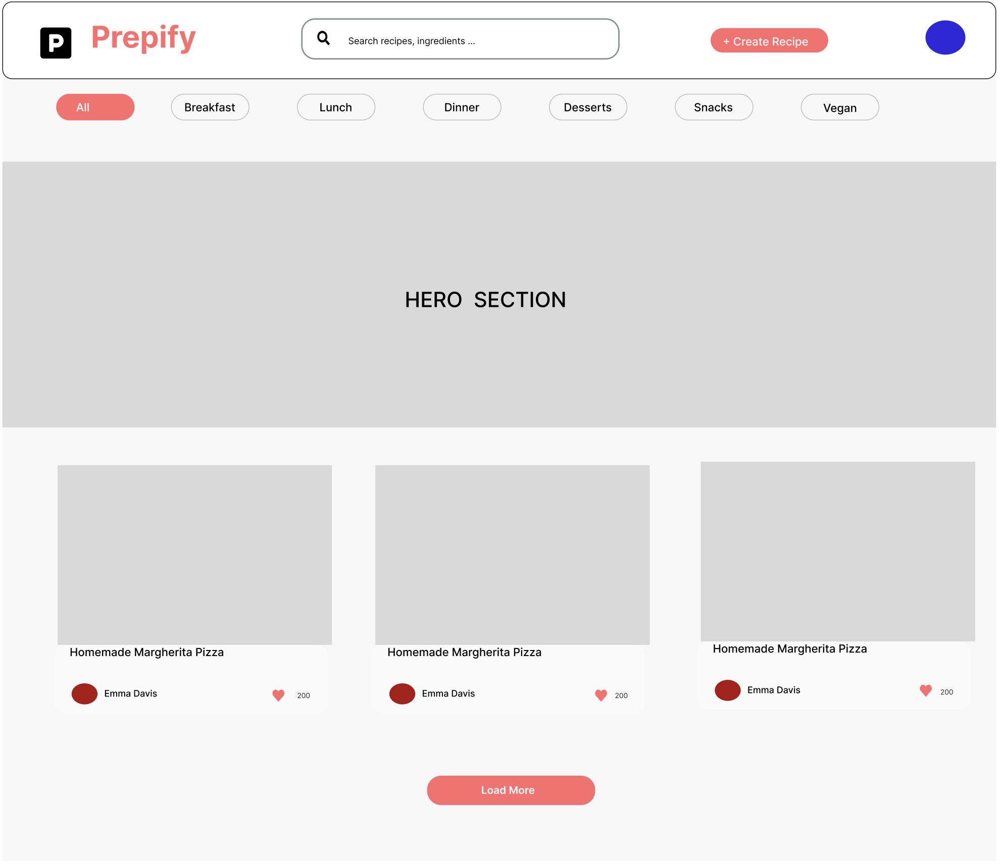

# RecipesGo – Web Project

RecipesGo is a collaborative DevOps project focused on building, testing, and deploying a full-stack web application using modern DevOps practices. 

# RecipesGO web app link
- https://prepify-nu.vercel.app
---

##  Team Members
| Name | Role | GitHub Username |
|------|------|----------------|
| **Adam Ali** | DevOps Engineer| [2alia](https://github.com/2alia) |
| **David A** | DevOps Engineer| [dayv-exe](https://github.com/dayv-exe) |
| **Dafe** | DevOps Engineer| [Beastly12](https://github.com/Beastly12) |
| **Daniel** |  DevOps Engineer| [danielsauuce](https://github.com/danielsauuce) |
| **Zhihan** | DevOps Engineer| [2LIUZ98](https://github.com/2LIUZ98) |

---

##  Project Overview
The objective of this platfrom is to cater to an audience that loves cooking and recipe sharing. Moreover, users can give feedback by commenting recipes and liking them.


## Design

## **Figma**

---

##  Tech Stack

### **Frontend**
- React (Vite)
- Tailwind CSS
- Node.js
- Deployed on **AWS S3 + CloudFront**

### **Backend**
- Go (Golang)
- AWS Lambda + API Gateway
- Deployed using **AWS SAM**
- RESTful API structure

### **Database**
- AWS DynamoDB

### **DevOps & Tools**
- **GitHub Actions** – CI/CD automation  
- **Docker** – containerised builds  
- **AWS SAM CLI** – serverless deployment  
- **AWS CloudWatch** – logs and metrics  
- **GitHub Projects** – Kanban & sprint management
- **Cypress testing** - Frontend automated testing

---

##  CI/CD Workflow

### **Trigger Conditions**
- **Pull Requests:** Run unit tests for backend and frontend  
- **Push to `develop`:** Deploys to the **test** environment  
- **Push to `main`:** Deploys to the **production** environment  

### **Pipeline Stages**
1. **Build:**  
   - Backend binaries compiled in Docker  
   - Frontend built with Node (Vite)
2. **Test:**  
   - Unit tests run for Go backend modules  
   - Linting and component checks for React frontend
3. **Deploy:**  
   - Backend deployed via AWS SAM  
   - Frontend synced to S3 and distributed via CloudFront

---

##  Example Workflow File

```yaml

name: ci Workflow
run-name: ${{ github.actor }} is testing out GitHub Actions
on: [push]

jobs:
  Explore-GitHub-Actions:
    runs-on: ubuntu-latest
    steps:
      - run: echo "The job was automatically triggered by a ${{ github.event_name }} event."
      - run: echo "GitHub!"
      - run: echo "This job is now running on a ${{ runner.os }} server hosted by GitHub."
      - run: echo "The name of your branch is ${{ github.ref }} and your repository is ${{ github.repository }}."
      - name: Check out repository code
        uses: actions/checkout@v5
      - run: echo "The ${{ github.repository }} repository has been cloned to the runner."
      - run: echo "The workflow is now ready to test your code on the runner."
      - name: List files in the repository
        run: |
          ls ${{ github.workspace }}
      - run: echo "This job's status is ${{ job.status }}."


